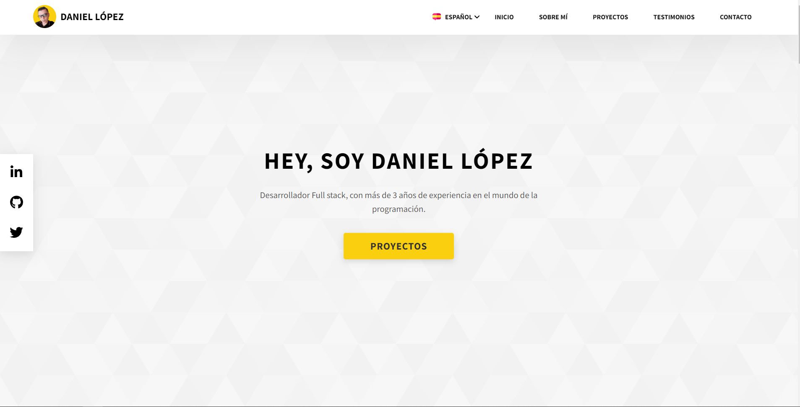
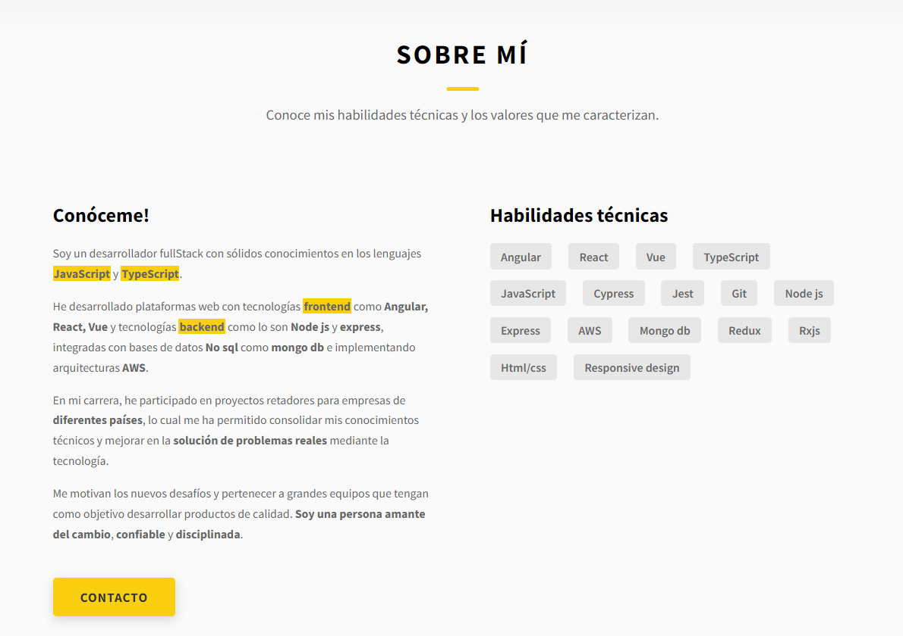
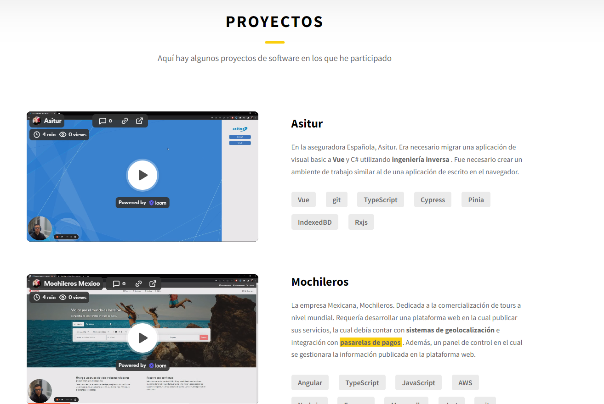
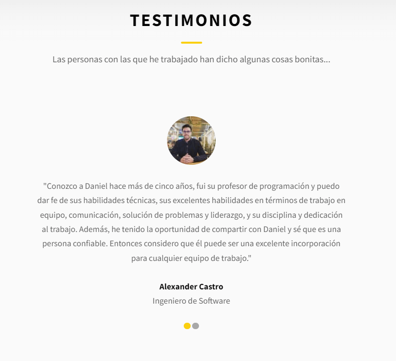
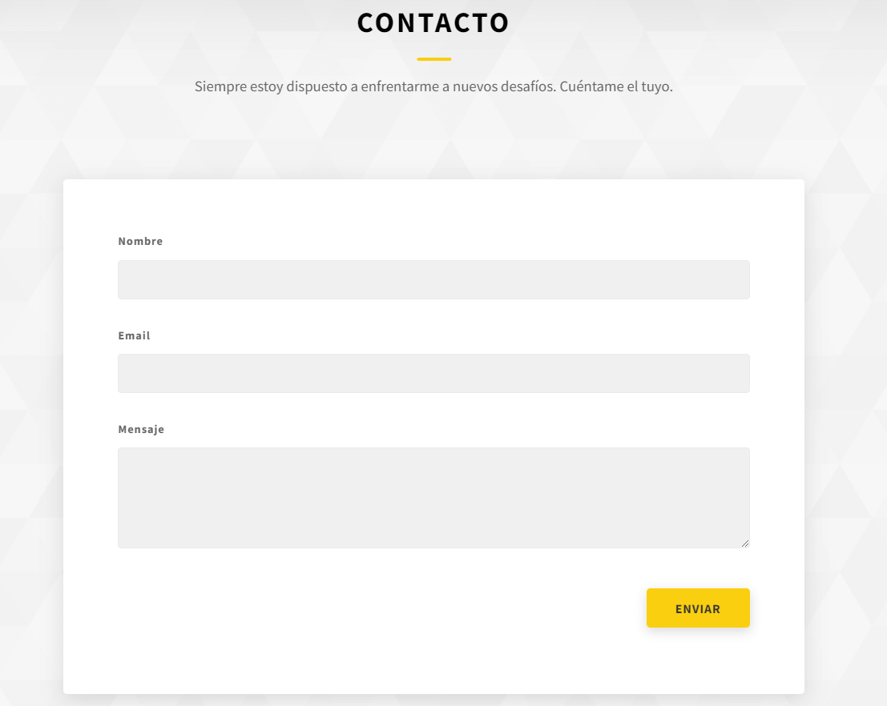
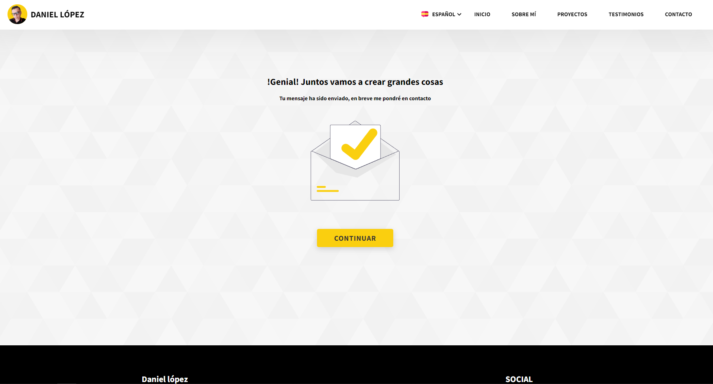
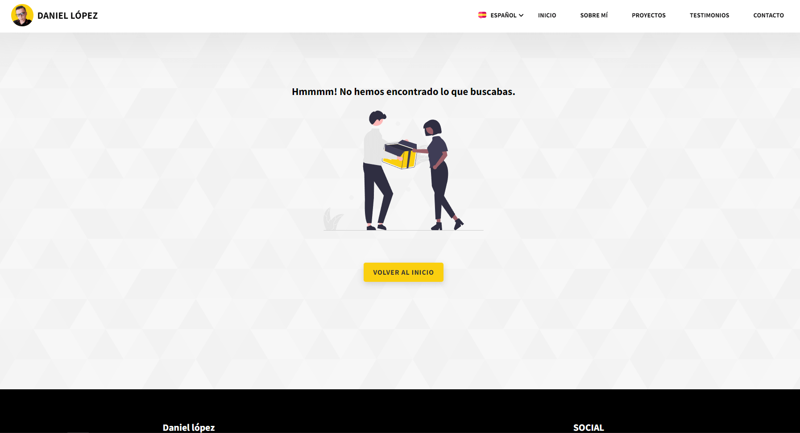

# Pagina Personal

Página persona, desarrollado con `Angular 14`. sus principales caracteristicas son el `manejo de multiples idiomas`, `envio de emails` y `diseño adaptativo`.

## Contenido

### **- Vista Principal**



### **- Acerca de**

  

### **- Proyectos**



### **- Recomendaciones**

 

## **Contacto**



### **- Contacto Exitoso**



### **- Pagina No encontrada**



# Principales Funcionalidades

## - Multi-Idioma

El sistema utiliza la libreria [ngx-translate](https://github.com/ngx-translate/core). la cual permite manejar multiples idiomas. Para este proyecto se maneja el idioma ingles y español.

### Ubicacion Archivos de Idiomas

```
src/assets/i18n/
```

En esta ruta se encuentran dos archivos `en.json` y `es.json` Cada uno contiene todas los textos del sistema en sus respectivos idiomas.

## - Diseño responsive

El sistema es adaptativo para diferentes dispositivos solamente utilizando `estilos css`.

## - Envio de Correo

El sistema utiliza [emailJs](https://www.emailjs.com/) para recibir todos los correos enviados desde el formulario de contacto.
<br>


<br>
