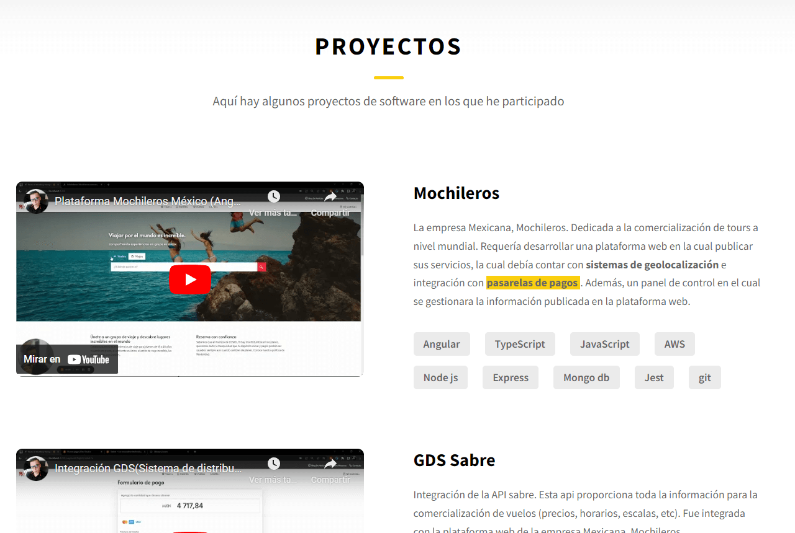

# Pagina Personal

Página persona, desarrollado con ``Angular 14``. cuenta manejo de multiples idiomas, envio de emails y diseño adaptativo.
## Contenido
### **- Vista Principal**
<br>

<br>

### **- Acerca de**

<br>
  
<br>

### **- Proyectos**

<br>

<br>

### **- Recomendaciones**

<br>
 
<br>
<br> 

## **Contacto**


### **- Contacto Exitoso**

<br>

### **- Pagina No encontrada** 

<br>

# Principales Funcionalidades

## - Multi-Idioma

El sistema utiliza la libreria [ngx-translate](https://github.com/ngx-translate/core). la cual permite manejar multiples idiomas. Para este proyecto se maneja el idioma ingles y español.

### Ubicacion Archivos de Idiomas

```
src/assets/i18n/
```

En esta ruta se encuentran dos archivos `en.json` y `es.json` Cada uno contiene todas los textos del sistema en sus respectivos idiomas.

<br>

## - Diseño responsive

El sistema es adaptativo para diferentes dispositivos solamente utilizando `estilos css`.

## - Envio de Correo

El sistema utiliza [emailJs](https://www.emailjs.com/) para recibir todos los correos enviados desde el formulario de contacto.
<br>


<br>
